Results
=======

# Questions we're answering

- What are important features in explaining variance in deforestation?
- How do the features change across the time interval 2004-2016?
- How much information leakage occurrs if spatial dependence is not considered?
- Do important feature vary accross the region?

# Test Train Split

Data split 70/30 between Train and Test data sets by municipality where municipalities are selected at random. Splitting by municipality is done to account for the spatial dependence of the data.  
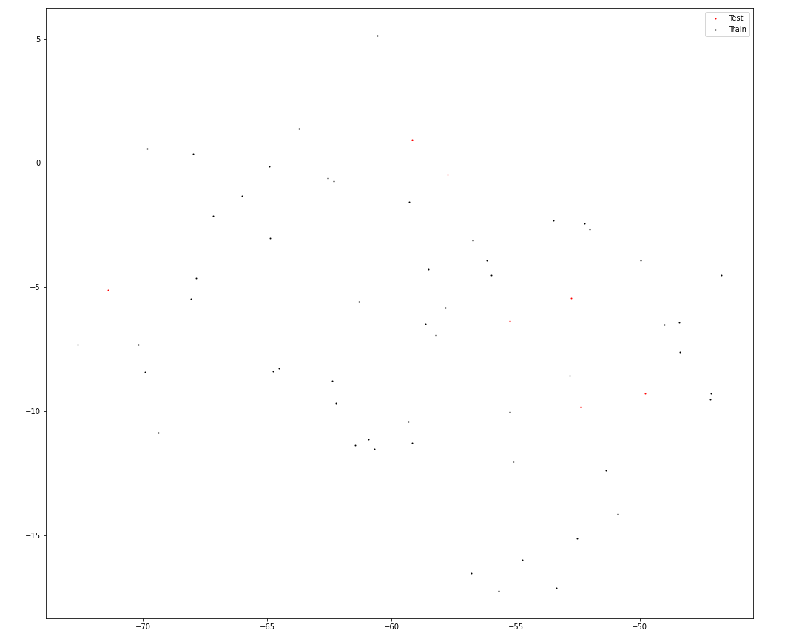  
Note that I use this same split for each panel of the sliding window and for each method within each panel.
# Procedure

## Models Fit

# Sliding Window Subsets
  
I use 3 years of data to predict the  following year's **deforest_diff** variable.
# Feature Importance
  
Feature importance scores for each method are normalized to sum to 1 here to understand their relative differences. Absolute vals are taken when necessary since some methods return signed feature importance and some don't.  
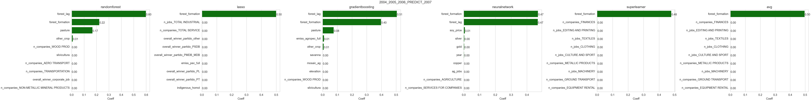  
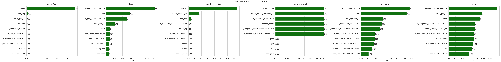  
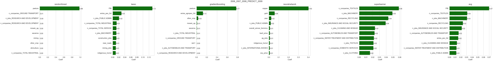  
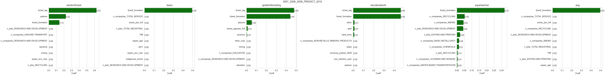  
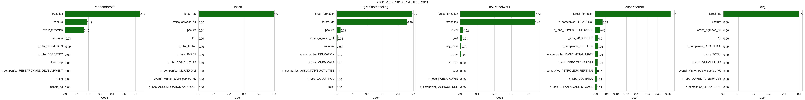  
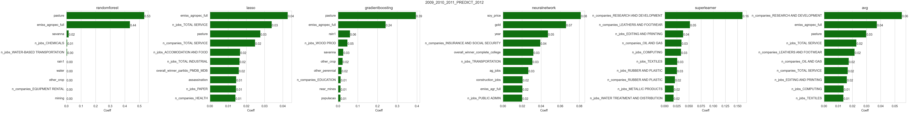  
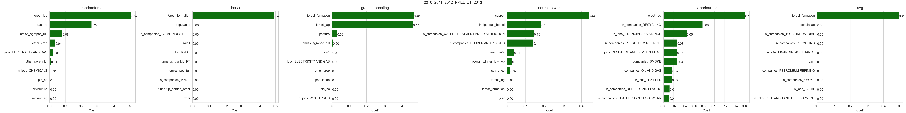  
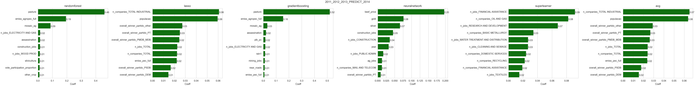  
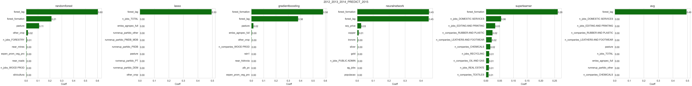  
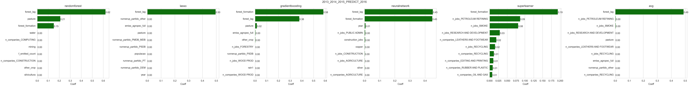
## Feature Importance without the **forest** variables.
  
'''forest_lag''' and '''forest_formation''' are both directly proportional to the response variable forest_diff, so it was expected that they would dominate the important features consistently.  
I repeat the above plots but exclude forest vars so others are visible.  
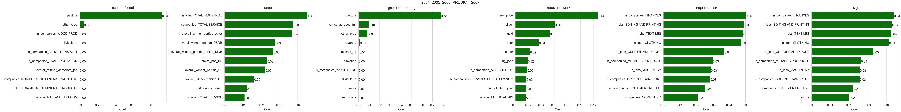  
  
  
  
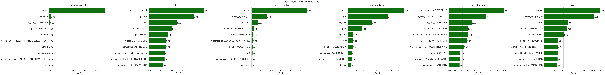  
  
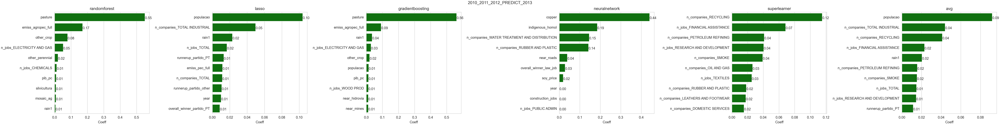  
  
  
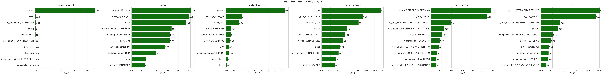
# Predicted Deforestation
  
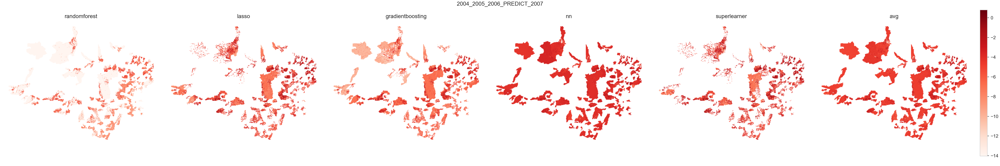  
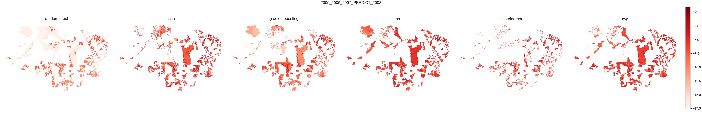  
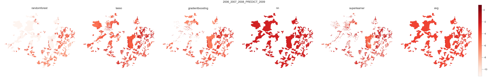  
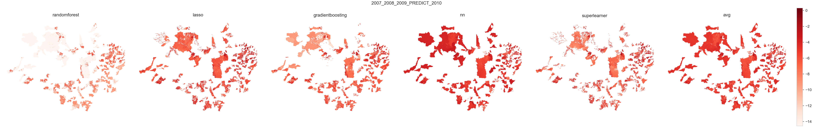  
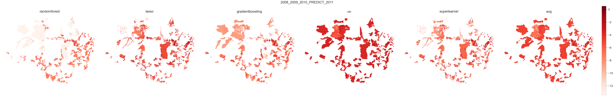  
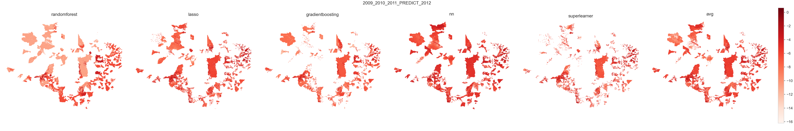  
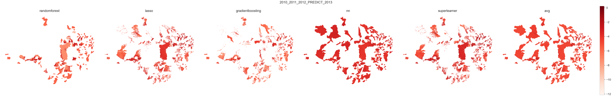  
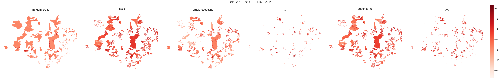  
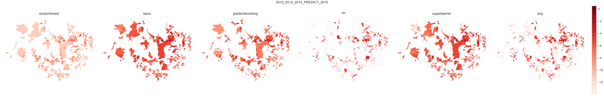  
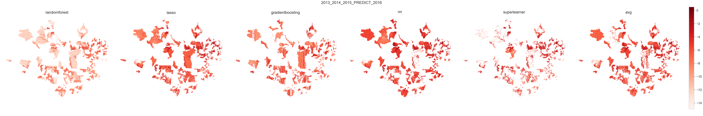
# Feature Importance Changing in Time
  
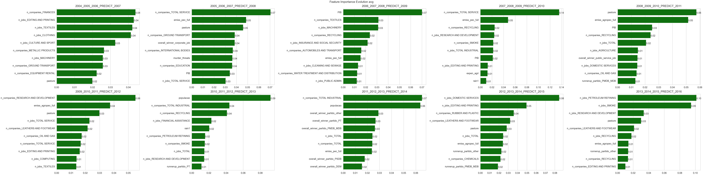  
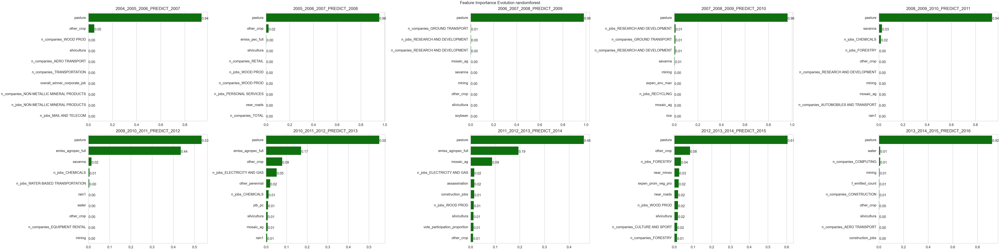  
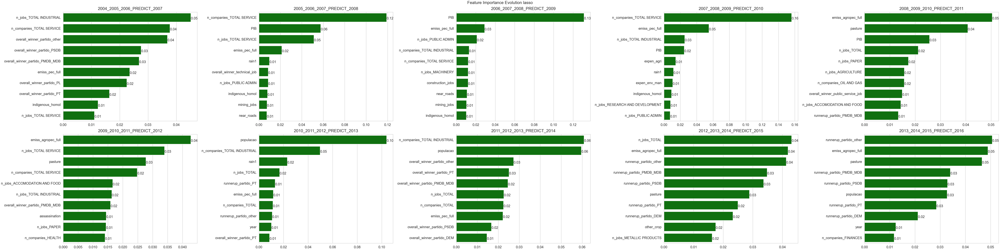  
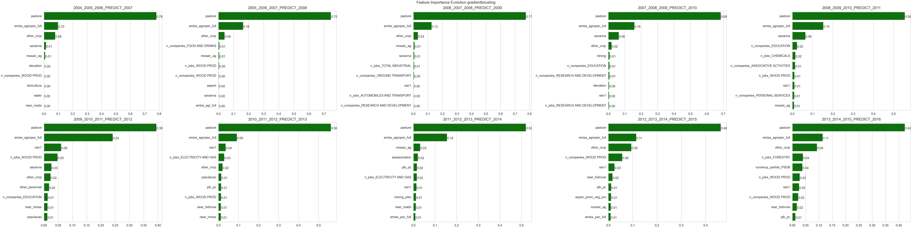  
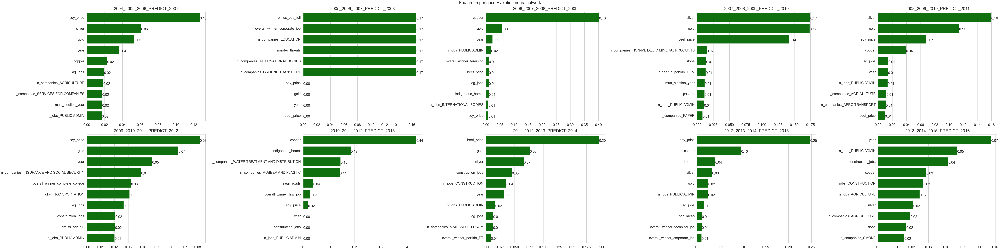  
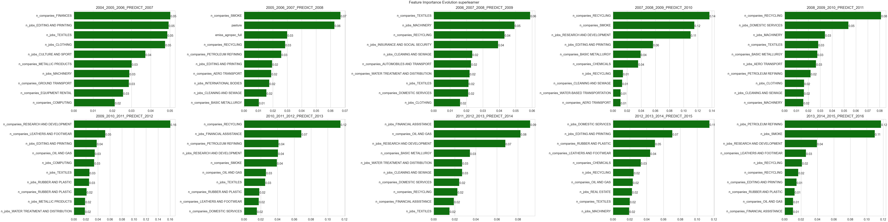
# Feature Importance

## 2004_2005_2006 predict 2007 feature importances
  
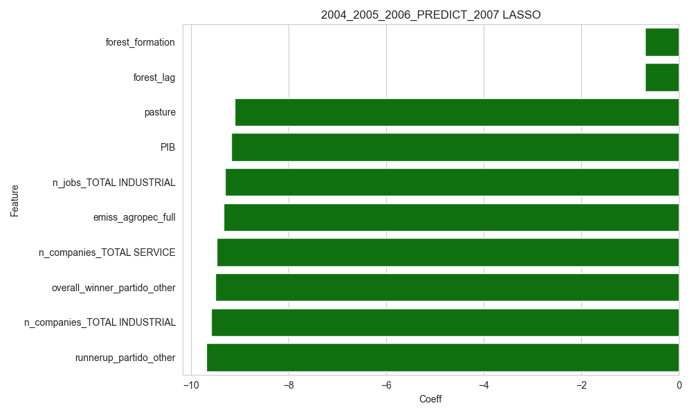  
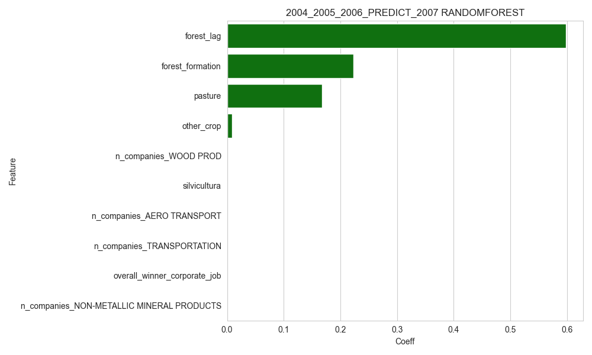  
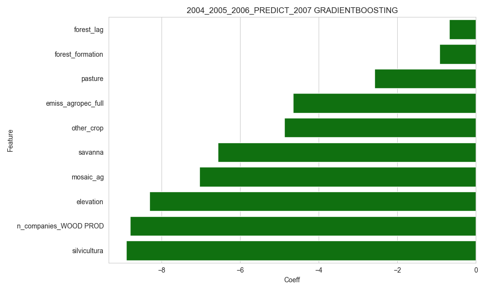  
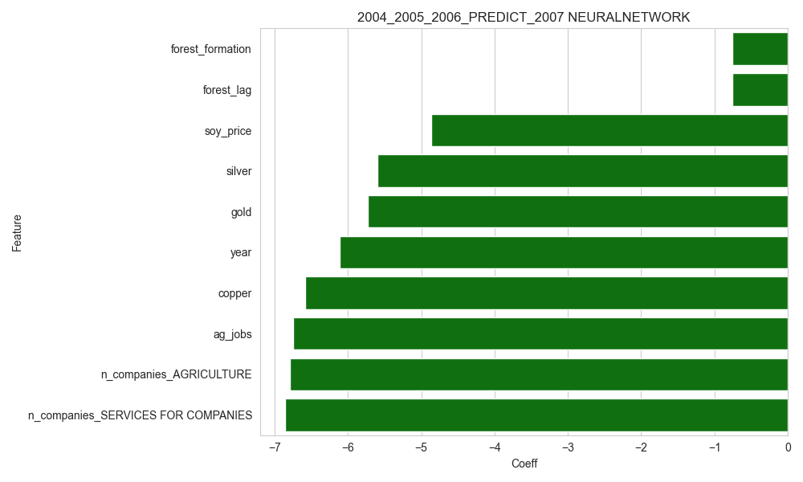  
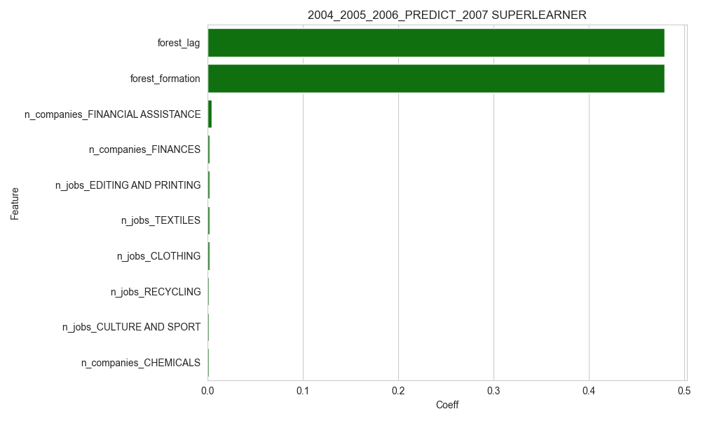