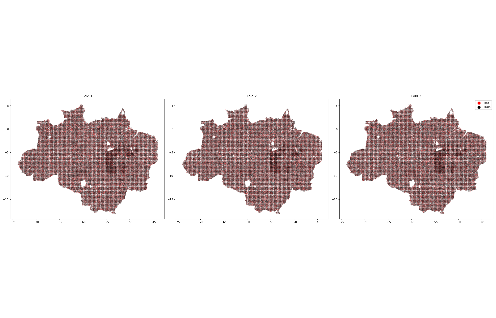
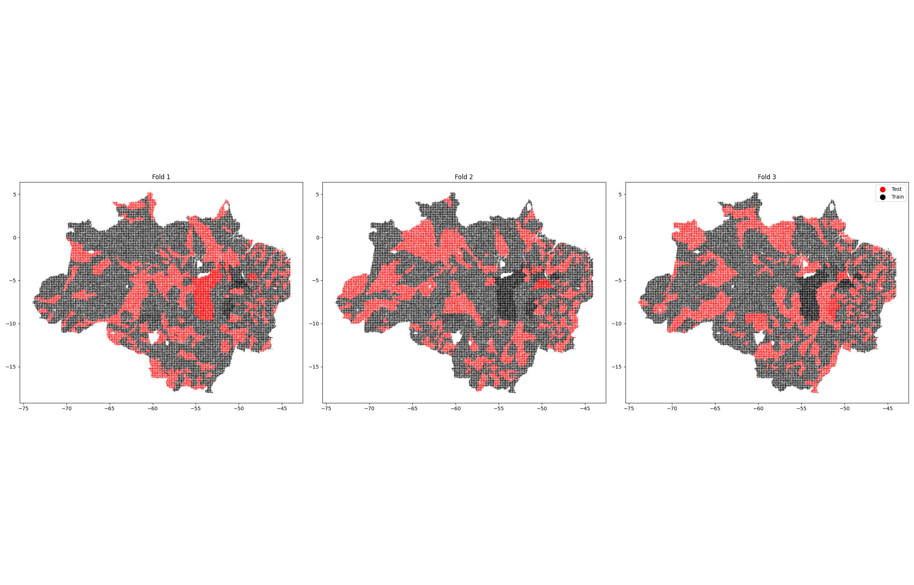
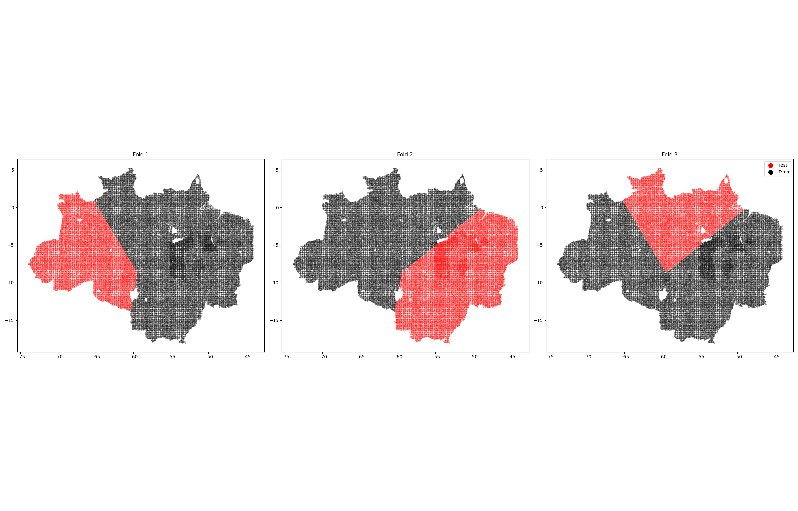
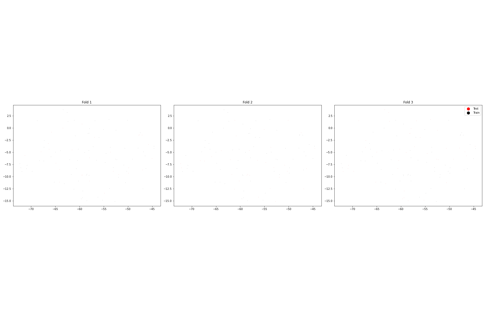

TestTrainFolds
==============

# Random Fold Assignment
  
Points split at random, spatial dependence is ignored  

# Municipality
  
Entire municipalities split at random, most conservative since no municipality in train set is seen in test set.  

# Spatial K Fold
  
spatial structure is preserved when assigning data points to each fold, neighboring points tend to be in the same fold so that when evaluating we test model on one fold while training on rest, ensures that the model is tested on spatially different regions  

# H Block
  
divide our data into non-consecutive blocks of a fixed size, let's say h. Each block consists of a group of consecutive data points. The purpose is to capture the correlation or dependence structure within each block, ensures that the training and validation sets have neighboring data points  

# Picking between these options:

- Calculate MSE for each of these CV methods
- Plot MSE in space for each of these CV methods
